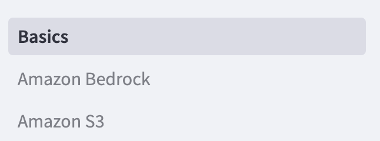
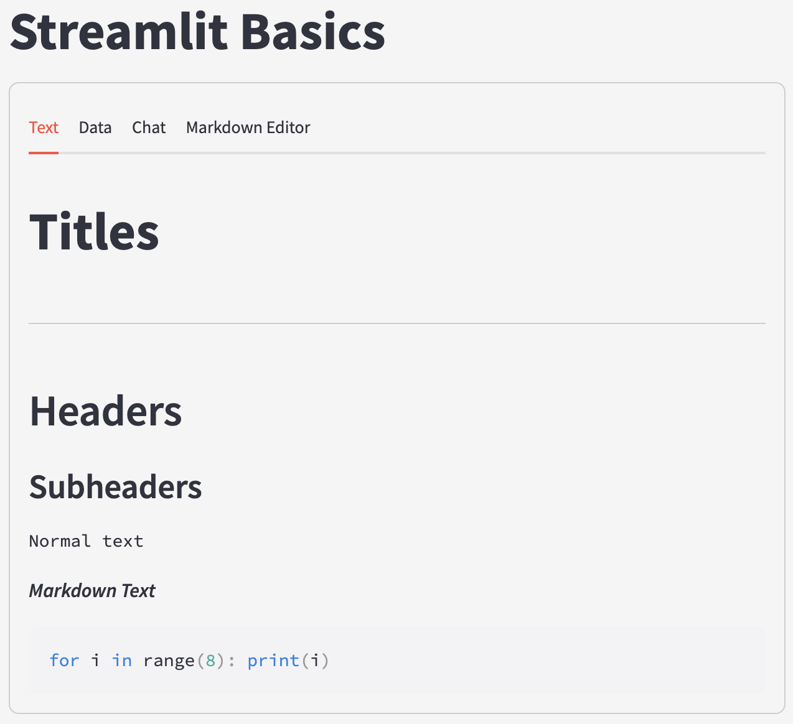
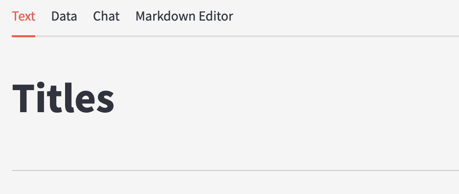
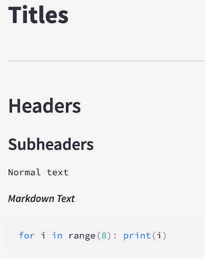
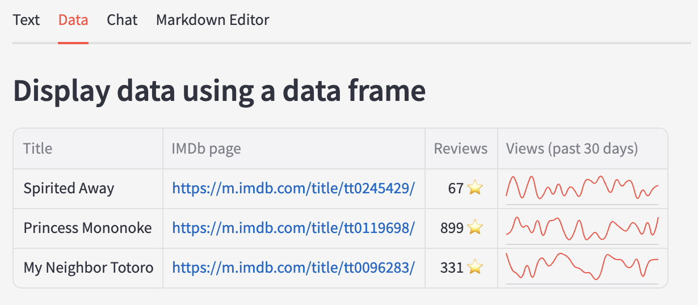
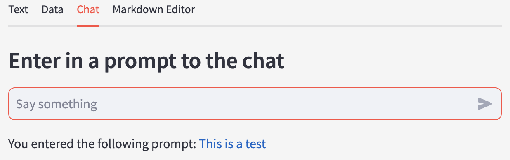
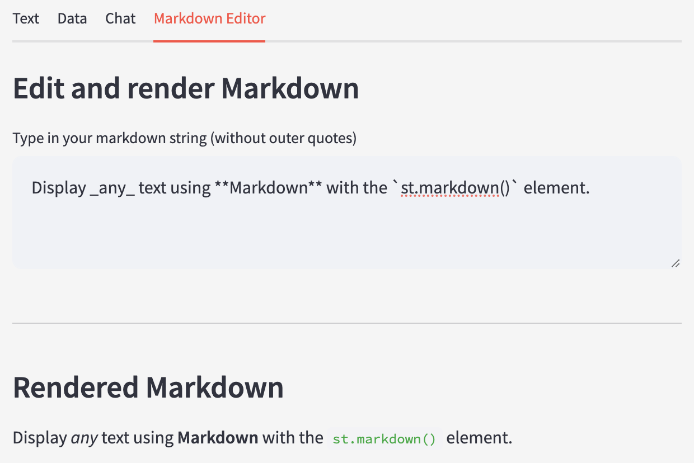
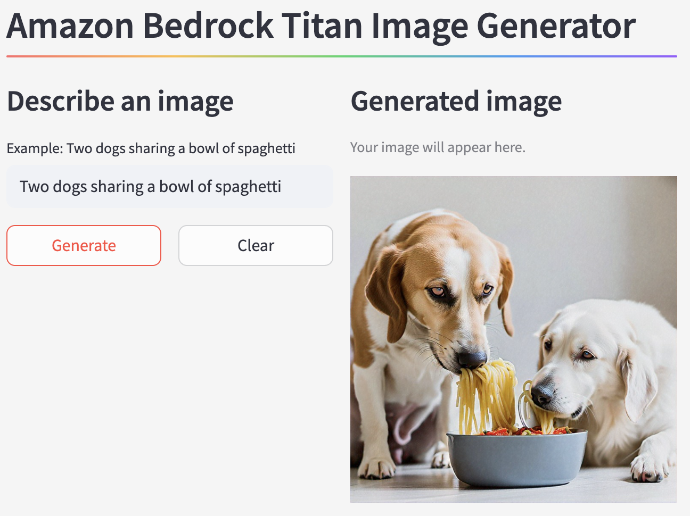
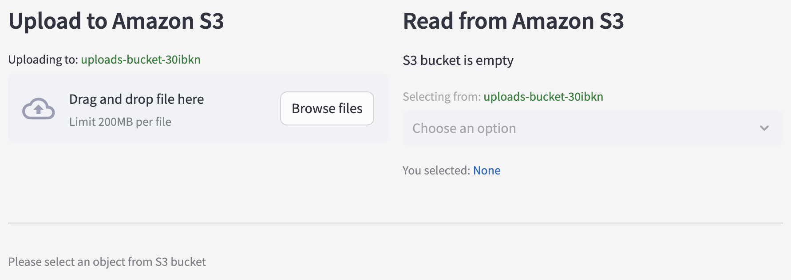
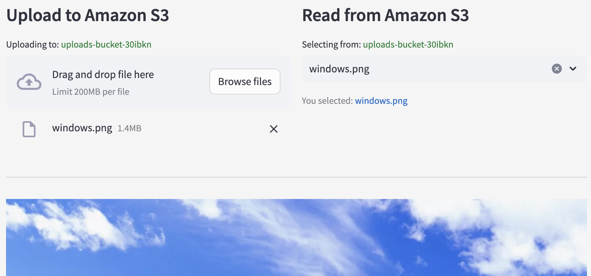

# ca-streamlit-demo

Streamlit application to demonstrate the basics of the Streamlit library, AWS resource integrations, and deployment to Amazon Elastic Cloud Compute (EC2).

### Run the app

```
cd src && streamlit run Basics.py
```













